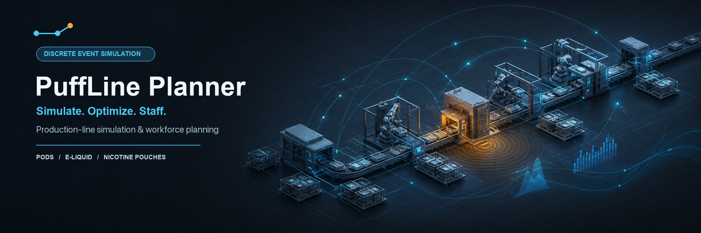
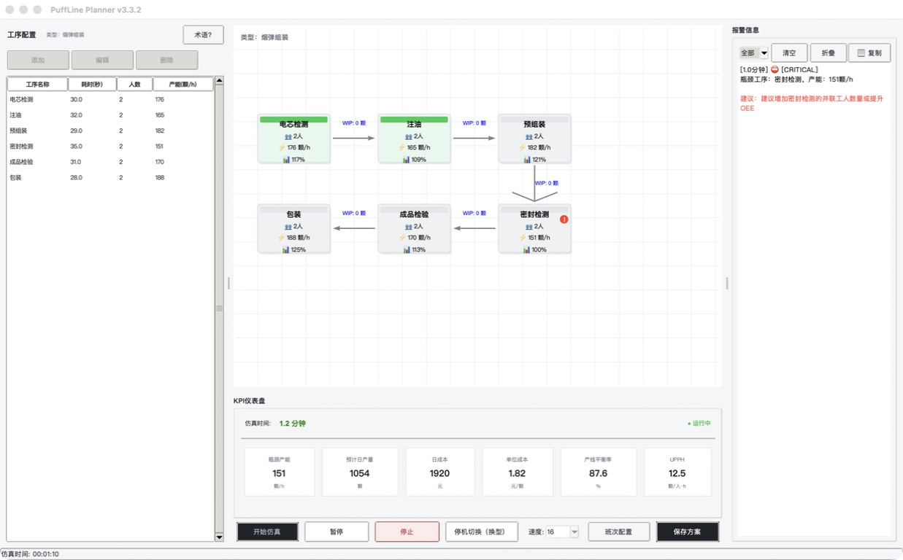

  <a href="https://github.com/MaxHou-infinity/puffline-planner/releases/latest"><strong>下载最新版</strong></a>
  ·
  <a href="#从产线数据到决策材料"><strong>查看工作流程</strong></a>
  ·
  <a href="docs/user-guide.md"><strong>阅读使用指南</strong></a>

  
  
  
  
  

# PuffLine Planner

**在投入现场试错前，用离散事件仿真比较产能、瓶颈、成本与人力配置方案。**

PuffLine Planner 是一款面向 IE 工程师、产线经理、精益顾问和 HRBP 的桌面决策工具。它覆盖烟弹组装、烟油灌装和尼古丁袋高速包装三种生产形态，将工序节拍、设备效率、WIP、人力和成本放进同一个可重复试算的模型中。

> 当前版本为 **v3.3.3 Public Beta**。仿真结果用于方案预评估，不替代现场测时、工艺验证、质量验证或法规合规判断。

## 它帮助你回答什么

| 决策场景 | PuffLine Planner 给出的结果 |
|---|---|
| 新线或改线前，哪里会先形成瓶颈？ | 工序产能、WIP、饥饿/堵塞、瓶颈与失衡方向 |
| 加人、提 OEE、缩短节拍，哪个动作更有效？ | 敏感性试算、批量方案对比、算法辅助优化 |
| 目标产量需要多少人，缺口何时出现？ | 岗位人数、班次、人力成本、招聘缺口与爬坡达产 |
| 如何把分析结果交给业务团队？ | Excel/PDF 报告、方案对比、KPI 历史与可复制结果表 |

## 从产线数据到决策材料

~~~mermaid
flowchart LR
    A["导入工序、节拍、人员与成本"] --> B["运行 SimPy 离散事件仿真"]
    B --> C["识别瓶颈、WIP 与失衡"]
    C --> D["比较加人、OEE、节拍和自动化方案"]
    D -->|继续试算| B
    D -->|选定方案| E["形成产能与人力配置建议"]
    E --> F["导出 Excel / PDF 决策材料"]
~~~

## 合成演示：6 工序烟弹装配线

下面的画面来自当前代码，使用不包含真实企业数据的合成参数。演示线设置 6 道工序、12 名人员，并刻意保留一个可诊断瓶颈，用于展示软件如何把工序数据转化为决策指标。

演示结果包括：

- 识别“密封检测”为当前瓶颈，瓶颈产能约 151 颗/小时；
- 预计日产量 1,054 颗，单位成本约 1.82 元/颗；
- 产线平衡率 87.6%，UPPH 约 12.5 颗/人·小时；
- 可继续比较加人、节拍优化或 OEE 改善后的变化。

节点中的百分比是相对当前瓶颈产能的能力指数，100% 为瓶颈基准，并非设备利用率。这些数字仅用于展示界面与分析路径，不代表真实工厂基准。

## 三种生产形态

| 生产形态 | 计量单位 | 重点建模能力 |
|---|---|---|
| 烟弹组装 | 颗 | 人工装配、BOM、组件缺料、返工与线平衡 |
| 烟油灌装 | 千克 | 配方、批次、储罐、CIP/SIP、原料库存与放行隔离 |
| 尼古丁袋高速包装 | 袋 | 机台节拍、OEE 分解、换型矩阵与高速包装线 |

## 核心能力

- **离散事件仿真**：并联/协同工序、有限缓冲区、饥饿、堵塞、切换和质量门；
- **瓶颈与失衡诊断**：工序级运行/等待/堵塞指标、WIP 方向与预测预警；
- **人力规划**：目标产量反推人数、多班次排班、人力成本、招聘缺口和爬坡达产；
- **方案试算**：敏感性分析、批量参数网格、KPI 历史、遗传算法辅助优化；
- **报告交付**：多方案对比以及 Excel/PDF 报告导出。

## 快速开始

### 方式一：下载桌面版

前往 [GitHub Releases](https://github.com/MaxHou-infinity/puffline-planner/releases/latest)，选择 macOS、Windows 或源码压缩包。

> v3.3.3 起，Release 附件统一使用 `PuffLine-Planner` 文件名；历史 v3.3.2 仍使用 `E-Pod-Line-Simulator`。请以 Release 页面实际列出的附件为准。
>
> macOS 当前发布包尚未签名和公证。首次启动如被 Gatekeeper 拦截，请在访达中右键应用并选择“打开”。请只从本仓库 Release 页面下载安装包。

### 方式二：源码运行

~~~bash
git clone https://github.com/MaxHou-infinity/puffline-planner.git
cd puffline-planner/e_pod_line_simulator
python -m pip install -r requirements.txt
python run.py
~~~

开发与测试：

~~~bash
python -m pip install -r requirements-dev.txt
python -m pytest tests -q
~~~

更完整的安装、配置、Excel 导入和 FAQ 请阅读 [用户指南](docs/user-guide.md)。

## 技术栈与质量信号

| 组件 | 用途 |
|---|---|
| Python 3.8+ / Tkinter | 本地桌面应用 |
| SimPy 4.0+ | 离散事件仿真引擎 |
| pandas / openpyxl | Excel 导入导出 |
| reportlab | PDF 报告 |
| pytest / pytest-cov | 自动化回归与覆盖率检查 |
| GitHub Actions / PyInstaller | CI 与 macOS/Windows 打包 |

项目在本地运行，不需要账号，也不会主动上传产线数据。当前 CI 状态可在 [Actions](https://github.com/MaxHou-infinity/puffline-planner/actions) 查看。

## 文档与参与

- [用户指南](docs/user-guide.md)：安装、工作流、配置、Excel 导入与 FAQ
- [更新日志](CHANGELOG.md)：版本能力与修复记录
- [贡献指南](CONTRIBUTING.md)：开发环境、测试和 Pull Request 要求
- [Issues](https://github.com/MaxHou-infinity/puffline-planner/issues)：Bug、功能建议和使用反馈

## 许可与边界

本项目采用自定义的[署名-授权许可证](LICENSE)，属于 **source-available（源码可用）**：

- 使用、复制或修改时必须保留署名与原始仓库链接；
- 对外发布、分发、销售或用于商业用途前，必须取得作者明确授权；
- 仿真结果不构成产能、成本、质量、安全或合规承诺，实际投产前应完成现场验证。

---

  <strong>Simulate. Optimize. Staff.</strong> 
  Production-line simulation and workforce planning for pods, e-liquid and nicotine pouches.

