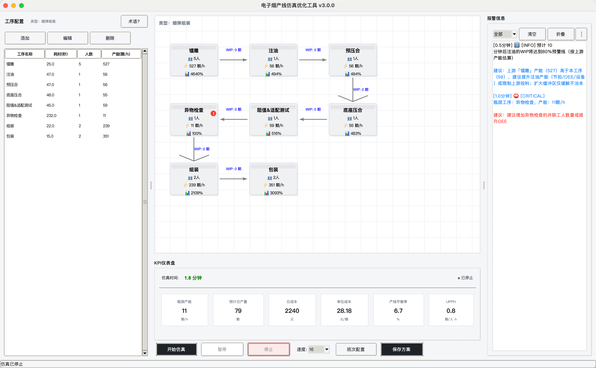

# E-Pod Line Simulator · 电子烟产线仿真优化工具

> **Simulate. Optimize. Staff.** —— 离散事件产线仿真与人力配置决策工具，
> 覆盖 **烟弹组装 / 烟油灌装 / 尼古丁袋高速包装** 三种生产形态。
>
> Production Line Simulation & Optimization for E-cigarette Pods, E-liquid Filling
> and Nicotine Pouches — powered by SimPy.




---

## ✨ 亮点速览

- **把 2 周试错压缩到 2 小时仿真**：投入人力/设备前，量化产能、瓶颈、成本与人效，用数据替代“现场试错”；
- **覆盖 3 种真实业态**：烟弹组装（颗）、烟油灌装（千克·配方/批次/储罐/CIP）、尼古丁袋高速包装（袋·机台节拍/OEE 分解），字段与计量单位自动适配；
- **HR 视角的人力规划**：目标产量反推各岗位人数、多班次排班、人力成本、招聘缺口与爬坡达产，HRBP/HR 可直接导出 Excel/PDF；
- **智能评估与优化**：瓶颈/WIP/饥饿/堵塞/预测预警、敏感性试算、批量试算、KPI 历史趋势，乃至遗传算法自动寻优；
- **分析体验（V3.3）**：统一结果表格（导出/复制/基线对比）、智能优化基线Δ与锁定工序、敏感性一键应用、分析指南与就地术语说明
- **开箱即用**：macOS App / Windows EXE、源码包、启动器三种方式，零配置启动；GitHub Release 一键下载。

## 👥 面向谁

| 角色 | 解决什么问题 |
|------|--------------|
| **IE 工程师** | 新线平衡、瓶颈识别、参数 → 产能 / 线平衡 / 优化建议 |
| **产线经理** | 换型、维护、班次与排产对产出的影响 |
| **精益顾问** | 失衡分析、敏感性试算、改善建议与对标报告 |
| **HRBP / HR** | 人力需求预估、人力成本预算、招聘计划、爬坡达产预测 |

## 🧩 核心功能

### 仿真引擎（SimPy 离散事件）

- 并联 / 协同两种人力协作模式，WIP 缓冲区、饥饿 / 堵塞、切换事件
- 烟油批量过程：配方 → 调配 → 陈化 → 灌装 → QC → 放行；CIP/SIP 清洗
- 机台节拍建模（高速包装线）；质量门（抽检 / 缺陷 / 返工）
- V3.2 深化：储罐容量约束（满罐等待 / 报警）、批次排产序列、周期性 CIP、
  原料到货 / 投料 / 缺料阻塞、质量门放行隔离、BOM 组件消耗与返工回路

### 三种生产形态

| 形态 | 计量单位 | 行业关键能力 |
|------|----------|--------------|
| 烟弹组装 | 颗 | BOM / 组件缺料 / 返工回路 / 人工装配线平衡 |
| 烟油灌装 | 千克 | 配方 / 批次 / 储罐 / CIP-SIP / 原料库存 / 放行隔离 |
| 尼古丁袋高速包装 | 袋 | 机台节拍 / OEE 三要素分解 / 换型矩阵 / 高速包装线 |

### 人力规划（V3.2，面向 HRBP/HR）

- 目标产量反推各工序 / 工种人数（并联加人、协同加人无效自动识别）
- 多班次排班、加班、休息；人力成本（工资 / 加班 / 社保 / 招聘 / 培训 / 缺勤 / 离职）
- 按周招聘缺口时间线；新员工爬坡曲线与达产天数
- Excel（人力需求 / 成本 / 缺口）+ PDF 摘要一键导出

### 智能报警与评估

- 瓶颈、WIP 堆积、饥饿 / 堵塞、预测预警；建议按工序类型分流（协同工序不再误推“加人”）
- 工序级指标：运行 / 等待 / 堵塞、实际利用率、失衡分析、OEE 分解
- 敏感性试算（加人 / 减人 / OEE / 节拍 / 自动化替代 / 原料价格）
- 批量试算（参数网格自动仿真对比）、KPI 历史趋势（表格 + 折线图）
- 遗传算法智能优化：以单位成本或总产出为目标，输出 TOP 方案

### 报告与协作

- 方案持久化对比（最多 5 个）、Excel（10+ Sheet）/ PDF 报告导出
- 快速配置向导（模板 → 数据来源 → 班次 → 一键仿真）
- 统一浅色主题、命令面板（Ctrl+K）、快捷键、Toast、报警筛选 / 折叠

## 🚀 快速开始

### 方式一：macOS / Windows 安装包（零依赖）

从 [GitHub Releases](https://github.com/MaxHou-infinity/e-pod-line-simulator/releases/latest)
下载对应平台包：
- macOS：`E-Pod-Line-Simulator-v3.3.2-macOS.zip`，解压后双击 App
- Windows：`E-Pod-Line-Simulator-v3.3.2-Windows.zip`，解压后双击 EXE

### 方式二：压缩包（推荐普通用户）

下载 `E-Pod-Line-Simulator-v3.3.2.zip`：

1. 解压后进入 `e_pod_line_simulator`；
2. macOS 双击 `启动.command`，Windows 双击 `启动.bat`（首次自动安装依赖）。

### 方式三：命令行 / 开发者

```bash
cd e_pod_line_simulator
pip install -r requirements.txt   # 运行依赖
python run.py                      # 启动 GUI
```

```bash
pip install -r requirements-dev.txt
python -m pytest tests -q          # 138 个用例
```

## 📚 文档导航

- [详细 README（安装 / 配置 / FAQ）](e_pod_line_simulator/README.md)
- [更新日志 CHANGELOG](CHANGELOG.md) · [开发与贡献规范](AGENTS.md)

## 🛠 技术栈

| 组件 | 说明 |
|------|------|
| Python 3.8+ / Tkinter | 桌面应用（标准库 GUI） |
| SimPy 4.0+ | 离散事件仿真引擎 |
| pandas / openpyxl | Excel 导入导出 |
| reportlab | PDF 报告 |
| pytest / pytest-cov | 138 个用例 + 覆盖率 |
| GitHub Actions | CI 回归 + Release 自动打包（源码包 / macOS App / Windows EXE） |

## 📁 目录结构

```
e_pod_line_simulator/
├── src/        # 源码（models / simulation / hr_planning / optimizer / gui / reporting）
├── configs/    # 默认配置、Excel 模板、方案与运行历史
├── docs/       # 用户文档（截图等）
├── tests/      # 138 个 pytest 用例
├── packaging/  # PyInstaller 打包配置
└── assets/     # 图标与赞赏码资源
```

## 🏷 版本

当前版本 **v3.3.2**；历史版本与变更详见 [CHANGELOG](CHANGELOG.md)。

## 💬 支持与反馈

- 🐛 Bug / 建议：[GitHub Issues](https://github.com/MaxHou-infinity/e-pod-line-simulator/issues)
- ⭐ 觉得有用？欢迎 Star、Fork 与贡献
- ☕ 资助作者：扫描 `e_pod_line_simulator/assets/wechat_qr.png`（微信赞赏码）

## 📄 许可与免责

本项目采用 **署名-授权许可证 v1.0**（[LICENSE](LICENSE)）：允许使用与修改，
但须保留作者署名与出处；对外发布或商业使用前，须通知作者并取得明确授权。

仿真结果为产线设计与人力规划的参考，不构成产能或成本承诺；实际投产前请以现场验证为准，作者不对据此做出的决策损失承担责任。

## 🔍 关键词

电子烟、烟弹、烟油、尼古丁袋、产线仿真、离散事件仿真、数字孪生、产线优化、
人力配置、人效、UPPH、OEE、瓶颈分析、WIP、快速换型、CIP/SIP、SimPy、Tkinter、
Production Line Simulation, Discrete Event Simulation, Digital Twin, E-liquid Filling,
Nicotine Pouch, Manufacturing Optimization, Bottleneck Analysis, Line Balancing,
Manpower Planning, HR Planning, Python。
